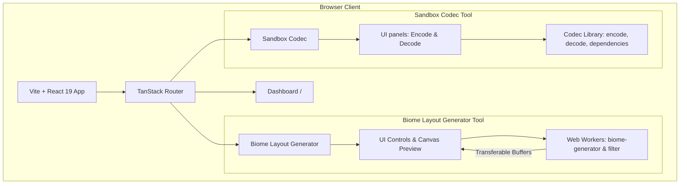

# 7DTD Game Tools

A high-performance, modular web-based toolkit for **7 Days to Die (7DTD)** server administrators, modders, and players. Built with a modern, reactive stack, it is designed for speed, flexibility, and a polished user experience.

## Tools & Features

### Biome Layout Generator (`/7dtd/biome-layout-generator`)
A highly configurable procedural generation engine that allows creators to instantly design regional biome structures.

* **9 Generation Algorithms**: Craft layouts using Random Seeds, Territory Expansion, Random Walkers, Random Blobs, Cellular Growth, Probability Fields, Recursive Split, Weighted Expansion, and Biome Islands.
* **Noise Mode**: Utilize Simplex, Perlin, Fractal, or Worley noise fields with configurable frequency, octaves, persistence, and lacunarity.
* **Multithreaded Processing**: Offloads heavy noise calculations and median filtering to Web Workers so the UI never drops a frame.
* **Smart Presets**: Out-of-the-box configurations for 7 Days to Die (5 biomes), Minecraft (7 biomes), Valheim (9 biomes), and Standard Earth (9 biomes).

### Sandbox Codec (`/7dtd/sandbox-codec`)
An interactive encoder and decoder for the V3.0 Sandbox Server Preset Codes introduced in 7 Days to Die.

* **Bi-directional Encoding/Decoding**: Easily convert a compact alphanumeric string back into editable options or vice versa.
* **120+ Options Configured**: Covers all core gameplay multipliers, settings, and flags.
* **Live Code Preview**: Encodes in real-time as you tweak slider values, toggles, or drop-downs.
* **Dependency System**: Options react to user selections (e.g., setting XP Multiplier to 0 automatically hides and disables Show XP).
* **Schema-backed Safety**: Warns about invalid entries, unknown values, and out-of-range inputs gracefully without crashing the app.

## Architecture Overview

The app is built as a single-page application (SPA) with tool-scoped state management to ensure high modularity and zero coupling between different tool routes.



## Tech Stack

- **Runtime**: Bun (v1.3.14+) — fast package installer and task runner
- **Bundler**: Vite 8 + React 19 — fast refresh and advanced rendering
- **Language**: TypeScript 7 — strict mode, bundler module resolution, `verbatimModuleSyntax`
- **Routing**: TanStack Router v1 — fully type-safe, file-based routing
- **Styling**: Tailwind CSS v4 — CSS-first architecture with OKLCH color spaces
- **UI Foundation**: shadcn/ui v4 (`base-nova` style, `@base-ui/react` primitives, Lucide React icons, `sonner` toasts)
- **Code Quality**: oxlint — ultra-fast Rust-based linter

## Getting Started

```bash
bun install
bun run dev
```

## Scripts

| Command | Description |
|---|---|
| `bun run dev` | Start Vite dev server (port 5173) |
| `bun run build` | `tsc -b && vite build` — typecheck then bundle |
| `bun run preview` | Preview production build |
| `bun run lint` | Run oxlint |

## Adding a Tool (For Developers)

This project is built to expand to other games and features easily. To add a new tool:

1. Create a route page at `src/routes/<game>/<tool-name>/index.tsx`.
2. Add components inside `src/components/<tool-name>/`.
3. Track tool-specific state inside its own Context provider in `src/context/` or local page state (avoid global variables).
4. Register the route link in `src/App.tsx` (sidebar) and `src/routes/index.tsx` (dashboard grid).
